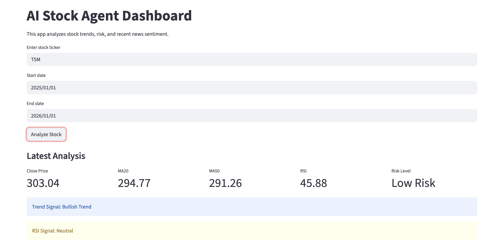

AI Stock Agent Dashboard

This project analyzes stock data using:
- yfinance
- moving averages
- RSI
- volatility risk
- Google News RSS
- rule-based sentiment analysis
- Streamlit dashboard

The system is designed as a modular AI agent:
app.py → user interface
agent.py → controller
stock_tool.py → technical analysis
news_tool.py → news collection
sentiment_tool.py → sentiment analysis
# AI Stock Agent Dashboard

## Overview

This project analyzes stock trends using:
- moving averages
- RSI
- volatility risk
- financial news
- sentiment analysis
- modular AI-agent architecture

How to Run

1. Create virtual environment
2. Install requirements:
   pip install -r requirements.txt
3. Run app:
   streamlit run app.py